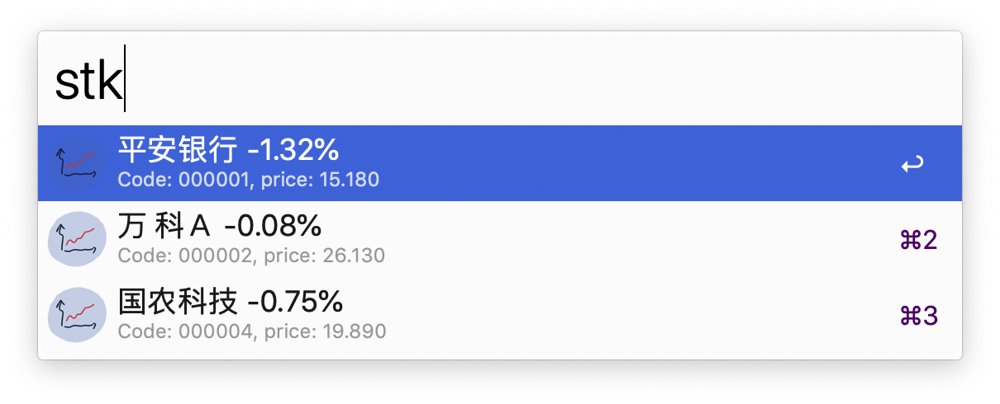

# Alfred-chinese-stock-info-workflow

This workflow fetches Chinese stock information in real-time.

You can cutomize the stock list of your own interests to display. Just [download it](https://github.com/yuanzhoucq/alfred-chinese-stock-info-workflow/releases/download/1.0/Chinese-Stock-Info.alfredworkflow) and simply change a stock code list, such as:

```
["000001", "000002", "000004"]
```

## Screenshot



## Acknowledgement
This workflow uses [chinese-stock-api](https://github.com/godsarmy/chinese-stock-api) and [alfred-workflow](https://github.com/deanishe/alfred-workflow) under the hood. Thanks!
